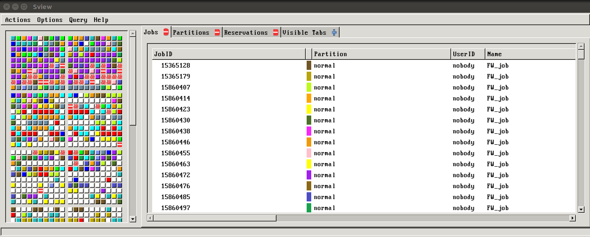
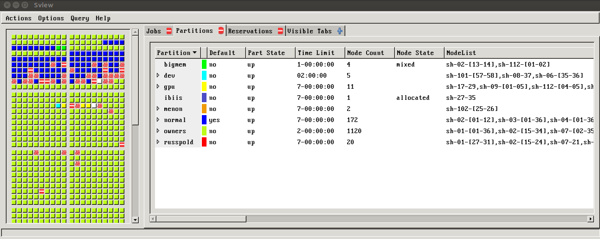

# SView SLURM



This is a container to run [sview](http://manpages.ubuntu.com/manpages/xenial/man1/sview.1.html) 
on your SLURM cluster. It's not the greatest visualization, but it's an old school
GUI that we wanted to try out at Stanford. It comes down to creating a container
with a full slurm (and sview install) that matches the version on your cluster.

The container is [built on Docker Hub](https://hub.docker.com/r/vanessa/sview) 
and the [tags that are provided](https://hub.docker.com/r/vanessa/sview/tags/) 
conincide with the verison of SLURM that you have. It's very important that you
choose the tag to match the version, otherwise sview won't work. We build this
as a Docker container, and then provided the container on 
the cluster as a [Singularity](https://singularityware.github.io) container.

## Usage
bv
You can technically use the container via Docker or Singularity. Intructions for
both are provided. **Important** remember that the version of slurm, in order for it to 
work with the sview in the container **must** match the one on your cluster
resource in order to read the file. If you follow the instructions and
get errors about unknown configuration values, you have two options:


### 1. Open an issue
Open an issue and ask @vsoch to build a container with your slurm version.
She would be happy to!

### 2. Build it yourself
You can also build it yourself! You just need to rebuild
the container and define the slurm version, here is the line in the [Dockerfile](Dockerfile)

```bash
ARG SLURM_VERSION=17.11.8
```

so build looks like this, given version 17.11.8:

```bash
VERSION=17.11.8
$ docker build --build-arg SLURM_VERSION=$VERSION -t vanessa/sview:$VERSION
```

The versions built (and provided at vanessa/sview) were chosen based on the slurm installed on the Sherlock cluster
at Stanford. You can find your own version via:

```bash
$ scontrol -V
```

### Singularity

Given a container on Docker Hub that matches your verison, you can start here.
The example below was derived for Singularity using a container pushed to Docker
Hub. 

Make sure that however you shell into your resource, you add `-XY` or similar
to forward the display.

```bash
ssh -XY vsochat@login.sherlock.stanford.edu
```

#### Step 1: Pull to Cluster from Docker Hub

If you decide to pull, here is how to control where the container is pulled to.

```bash
export SINGULARITY_CACHEDIR=${SCRATCH}/.singularity
export SINGULARITY_PULLFOLDER=${PWD}
```

And then to pull it. Remember to specify the version!

```bash
singularity pull docker://vanessa/sview:17.11.8
```

Then cd to the container, and export the variable for `SLURM_CONF`

```bash
export SLURM_CONF=/etc/slurm/slurm.conf

```

Finally, run the container and bind **both** to `/etc/slurm` and `/var/run/munge`

```bash
$ singularity run --bind /etc/slurm --bind /var/run/munge sview-17.11.8.simg 
```

That should do it! Depending on the size of your cluster, this step might actually
take a minute or two to "boot up" the visualization (it did for our resource). 
As long as you don't see significant error messages (beyond an issue with
the canberra module which can be safely ignored) it should be working.
Check out this old school magic!


